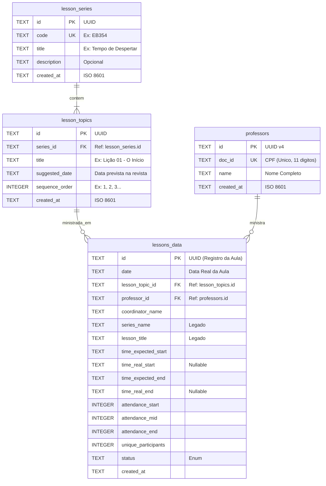

# 📊 EB Insights


-blue)

-orange)

Um aplicativo **mobile-first** para coleta de dados de frequência e engajamento da Escola Bíblica (EB), com arquitetura **local-first** (offline-first).

---

## 🚀 Funcionalidades Implementadas

### ✅ Coleta de Dados (Feature 001)

- Formulário em 3 momentos: Início, Meio e Fim da aula
- Contadores de frequência com steppers (+ / -)
- Captura automática de horários com um toque
- Auto-save com debounce de 500ms
- Recuperação de aulas em andamento

### ✅ Cadastro de Professores (Feature 002)

- Cadastro com validação de CPF (algoritmo oficial)
- Formatação automática do CPF na digitação
- Picker para seleção de professor na aula
- Proteção contra exclusão de professor com aulas vinculadas
- Migração automática de banco de dados existente

### ✅ Schema Normalizado (Feature 003)

- Tabelas dedicadas para séries de lições (`lesson_series`) e tópicos (`lesson_topics`)
- Seleção de série e tópico via Pickers (substituindo texto livre)
- Migração automática de dados existentes com normalização de texto
- CRUD completo para gerenciamento de séries e tópicos
- Proteção contra exclusão de séries com aulas vinculadas
- Campos legados preservados para compatibilidade

---

## 📱 Telas do Aplicativo

| Tela | Descrição |
|------|-----------|
| `/` | Lista de aulas com status, série e professor |
| `/lesson/new` | Criar nova aula (com seleção de série/tópico) |
| `/lesson/[id]` | Formulário de coleta (3 momentos) |
| `/professors` | Lista de professores cadastrados |
| `/professors/new` | Cadastrar novo professor |
| `/series` | Lista de séries de lições |
| `/series/new` | Cadastrar nova série |
| `/series/[id]` | Detalhes da série com tópicos |
| `/topics/new` | Cadastrar novo tópico |
| `/topics/[id]` | Detalhes/edição do tópico |
| `/sync` | Exportar dados (JSON) |

---

## 🏗️ Arquitetura

```
┌─────────────────────────────────────────────────────────┐
│                    Expo Router (app/)                   │
├─────────────────────────────────────────────────────────┤
│  Screens        │  Components       │  Services         │
│  - index.tsx    │  - CounterStepper │  - lessonService  │
│  - lesson/[id]  │  - TimeCaptureBtn │  - professorSvc   │
│  - professors/  │  - ProfessorPicker│  - seriesService  │
│  - series/      │  - SeriesPicker   │  - topicService   │
│  - topics/      │  - TopicPicker    │  - exportService  │
├─────────────────────────────────────────────────────────┤
│                    SQLite (expo-sqlite)                 │
│                   📱 Local-First Storage                │
└─────────────────────────────────────────────────────────┘
```

**Princípios:**

- **Local-First**: SQLite é a única fonte de verdade
- **Zero-Friction UX**: Steppers e Pickers ao invés de teclado
- **Auto-Save**: Mudanças salvas automaticamente (debounce 500ms)
- **Fail-Safe**: Estado recuperável após fechar o app

---

## 🗄️ Modelo de Dados

### Tabela `lesson_series`

| Campo | Tipo | Descrição |
|-------|------|-----------|
| `id` | TEXT (UUID) | Identificador único |
| `code` | TEXT (UNIQUE) | Código da série (ex: EB354) |
| `title` | TEXT | Título da série |
| `description` | TEXT | Descrição opcional |
| `created_at` | TEXT | Data de cadastro |

### Tabela `lesson_topics`

| Campo | Tipo | Descrição |
|-------|------|-----------|
| `id` | TEXT (UUID) | Identificador único |
| `series_id` | TEXT (FK) | Referência à série |
| `title` | TEXT | Título do tópico |
| `suggested_date` | TEXT | Data sugerida na revista |
| `sequence_order` | INTEGER | Ordem sequencial (1, 2, 3...) |
| `created_at` | TEXT | Data de cadastro |

### Tabela `lessons_data`

| Campo | Tipo | Descrição |
|-------|------|-----------|
| `id` | TEXT (UUID) | Identificador único |
| `date` | TEXT | Data da aula (YYYY-MM-DD) |
| `lesson_topic_id` | TEXT (FK) | Referência ao tópico |
| `professor_id` | TEXT (FK) | Referência ao professor |
| `series_name` | TEXT | (Legado) Série de lições |
| `lesson_title` | TEXT | (Legado) Título da lição |
| `time_expected_start` | TEXT | Horário previsto início (10:00) |
| `time_real_start` | TEXT | Horário real início |
| `time_expected_end` | TEXT | Horário previsto término (11:00) |
| `time_real_end` | TEXT | Horário real término |
| `attendance_start` | INTEGER | Frequência no início |
| `attendance_mid` | INTEGER | Frequência no meio |
| `attendance_end` | INTEGER | Frequência no fim |
| `unique_participants` | INTEGER | Participantes únicos |
| `status` | TEXT | IN_PROGRESS / COMPLETED / SYNCED |

### Tabela `professors`

| Campo | Tipo | Descrição |
|-------|------|-----------|
| `id` | TEXT (UUID) | Identificador único |
| `doc_id` | TEXT (UNIQUE) | CPF validado (11 dígitos) |
| `name` | TEXT | Nome completo |
| `created_at` | TEXT | Data de cadastro |



---

## 🛠️ Tecnologias

- **React Native** + **Expo SDK 54**
- **Expo Router** (File-based routing)
- **TypeScript** (Strict mode)
- **SQLite** (`expo-sqlite`)
- **Jest** (Testes unitários)

---

## 🚀 Como Executar

```bash
# Instalar dependências
npm install

# Iniciar servidor de desenvolvimento
npm start

# Executar testes
npx jest
```

**Requisitos:**

- Node.js 18+
- Expo Go no celular (Android/iOS)

---

## 📁 Estrutura do Projeto

```
app/                    # Telas (Expo Router)
├── index.tsx           # Home - Lista de aulas
├── lesson/             # Formulário de coleta
├── professors/         # CRUD de professores
├── series/             # CRUD de séries de lições
├── topics/             # CRUD de tópicos
└── sync/               # Exportação de dados

src/
├── components/         # CounterStepper, TimeCaptureButton, Pickers
├── db/                 # Schema, migrations, cliente SQLite
├── services/           # Lógica de negócio (lesson, professor, series, topic)
├── types/              # Interfaces TypeScript
├── hooks/              # useDebounce
└── utils/              # Validação de CPF, normalização de texto

specs/                  # Especificações (Spec-Driven Dev)
tests/                  # Testes unitários
```

---

## 📋 Roadmap

- [x] **Feature 001**: Coleta de dados (formulário 3 momentos)
- [x] **Feature 002**: Cadastro de professores com CPF
- [x] **Feature 003**: Migração para schema normalizado (lesson_series/lesson_topics)
- [ ] **Feature 004**: Dashboard local com métricas
- [ ] **Feature 005**: Sincronização com API na nuvem
- [ ] **Feature 006**: Relatórios PDF/Excel

---

## 📖 Histórias de Usuário

| ID | Persona | Desejo | Status |
|----|---------|--------|--------|
| US01 | Coordenador | Preencher dados da aula em formulário mobile | ✅ Implementado |
| US02 | Coordenador | Visualizar variação de público (Início/Meio/Fim) | ✅ Implementado |
| US03 | Diretor | Contar participantes únicos (engajamento) | ✅ Implementado |
| US04 | Diretor | Cruzar presença/engajamento com professor | ✅ Implementado |
| US05 | Diretor | Comparar por Série/Título da Lição | ✅ Implementado |
| US06 | Coordenador | Registrar horários reais de início/fim | ✅ Implementado |
| US07 | Admin | Gerenciar séries e tópicos de lições | ✅ Implementado |

---

## 📊 Métricas Capturadas

- **Logística:** Data, Horários Previstos e Reais
- **Conteúdo:** Professor, Série de Lições, Título
- **Frequência:** Público no Início, Meio e Fim da aula
- **Engajamento:** Participantes únicos (pessoas distintas que falaram)

---

## TROUBLESHOOTINGS

Você pode encontrar soluções para problemas comuns no arquivo [Troubleshootings.md](./Troubleshootings.md).

---

## 📄 Licença

Projeto desenvolvido para uso interno da Escola Bíblica.
