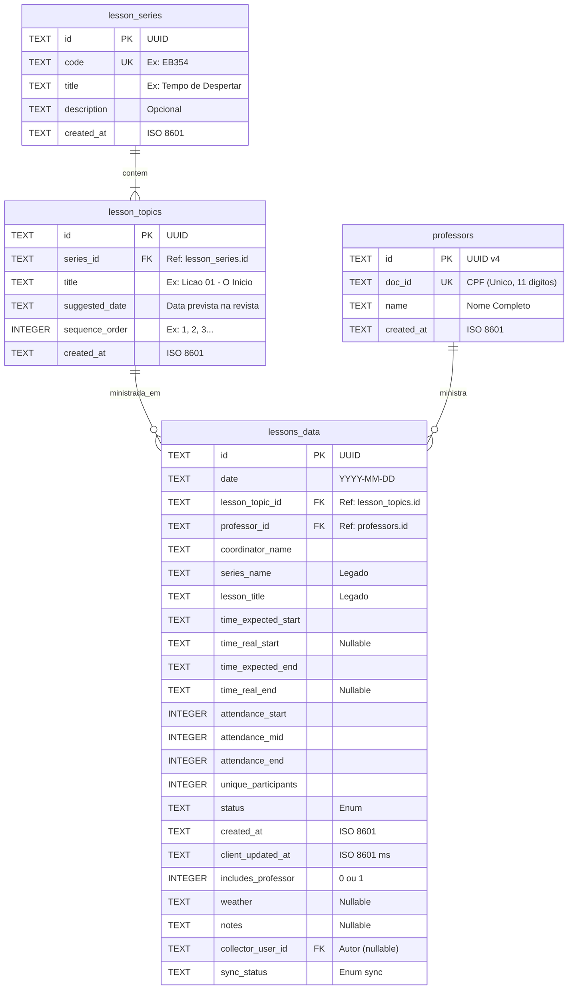

<div align="center">

# 📊 EB Insights


-blue)

-orange)

Um aplicativo **mobile-first** para coleta de dados de frequência e engajamento da Escola Bíblica (EB), com arquitetura **local-first** (offline-first).

</div>

---

[Funcionalidades](#-funcionalidades-implementadas) · [Telas](#-telas-do-aplicativo) · [Arquitetura](#️-arquitetura) · [Modelo de Dados](#️-modelo-de-dados) · [Tecnologias](#️-tecnologias) · [Como Executar](#-como-executar) · [Ambiente Integrado](#-ambiente-local-integrado-mobile--backend) · [API](#-documentação-da-api) · [Roadmap](#-roadmap)

---

## 🚀 Funcionalidades Implementadas

### ✅ Coleta de Dados (Spec 001)

- Formulário em 3 momentos: Início, Meio e Fim da aula
- Contadores de frequência com steppers (+ / -)
- Captura automática de horários com um toque
- Auto-save com debounce de 500ms
- Recuperação de aulas em andamento
- Exclusão de aulas em andamento (com confirmação e validação de status)

### ✅ Cadastro de Professores (Spec 002)

- Cadastro com validação de CPF (algoritmo oficial)
- Formatação automática do CPF na digitação
- Picker para seleção de professor na aula
- Proteção contra exclusão de professor com aulas vinculadas
- Migração automática de banco de dados existente

### ✅ Schema Normalizado (Spec 003)

- Tabelas dedicadas para séries de lições (`lesson_series`) e tópicos (`lesson_topics`)
- Seleção de série e tópico via Pickers (substituindo texto livre)
- Migração automática de dados existentes com normalização de texto
- CRUD completo para gerenciamento de séries e tópicos
- Proteção contra exclusão de séries com aulas vinculadas
- Campos legados preservados para compatibilidade

### ✅ Design e Experiência do Usuário (Spec 004)

- Navegação por abas (Bottom Tabs): Aulas, Painel, Séries, Professores, Sincronizar
- Sistema de temas com suporte a modo claro, escuro e automático (segue o sistema)
- Barra de filtros horizontais com multi-select por status na listagem de aulas
- Badges de status com ícones e cores distintas (Em Andamento, Completa, Exportada, Sincronizada)
- Componentes animados (AnimatedPressable com feedback tátil via Reanimated)
- Skeleton loaders para estados de carregamento
- Empty states e telas de erro com retry
- Floating Action Button (FAB) para criação rápida
- Date Picker nativo integrado ao formulário de aulas
- Tela de configurações com seleção de tema

### ✅ Export Data Contract v2 (Spec 005)

- Exportação JSON v2 com envelope tipado (`schema_version: "2.0"`)
- Resolução XOR automática: professor_id/professor_name, topic_id/topic_title, series_id/series_code_fallback
- `device_id` persistente via AsyncStorage (UUID v4 estável entre sessões)
- `client_updated_at` com precisão em milissegundos para reconciliação futura
- Toggle "Contei o professor nestas contagens" no formulário de aula (FR-019)
- Campos `weather` e `notes` (observações livres) no formulário de aula (FR-020)
- Padrão configurável para `includes_professor` nas Configurações (FR-021)
- Guard de exportação vazia com alerta em pt-BR (FR-008)
- Migração idempotente com backfill crash-safe de `client_updated_at`
- Seed service estendido para carregar dados de exemplo com os novos campos

### ✅ Autenticação e Identidade (Spec 006)

- Auto-cadastro com o primeiro usuário assumindo o papel de coordenador automaticamente
- Login opcional: o app continua funcionando offline e para usuários anônimos
- Coletas marcadas com `collector_user_id` imutável no momento da criação
- Lista de aulas filtrada pelo usuário logado; todas as coletas quando anônimo
- Logout limpa credenciais sem apagar dados locais
- Token JWT armazenado via `expo-secure-store` (keystore nativo)

### ✅ Backend de Sincronização (Spec 007)

- API Fastify 5 + Prisma 7 + PostgreSQL 16 em `server/`
- Endpoints de auth (register/login), catálogo (series/topics/professors) e coleções v2
- Agregação de coletas por mediana (com normalização de professor nas presenças)
- Moderação do coordenador para aceitar/rejeitar coleções e catálogo submetido
- JWT com 7 dias de validade; primeiro usuário registrado vira coordenador
- Idempotência por UUID do cliente e versionamento de schema
- Rate limiting, RBAC e tratamento de erros centralizados via plugins Fastify
- Detalhes completos em [`server/CLAUDE.md`](./server/CLAUDE.md)

### ✅ Cliente de Sincronização Offline (Spec 008)

- Nova coluna `sync_status` em `lessons_data`: `LOCAL → QUEUED → SENDING → SYNCED | REJECTED`
- Loop de sync em foreground com batches de até 20 itens por envio
- Backoff exponencial de 30s a 30min com suporte ao header `Retry-After`
- Aba `/sync` refeita: lista de pendentes + histórico dos últimos 7 dias
- Badge no header da Home indicando quantidade de coletas pendentes
- `catalogSyncService` puxa `/catalog?since=<timestamp>` no login e a cada 1 hora
- Timeout de 30s por requisição via `AbortController`
- 401 limpa JWT e redireciona; 4xx move o item para `REJECTED` com motivo

### ✅ Dashboard de Estatísticas (Spec 009)

- Aba "Painel" com 5 gráficos interativos (react-native-gifted-charts)
- Gráfico de pontualidade (atraso em minutos por aula)
- Curva de presença (início/meio/fim por aula)
- Tendência de participantes únicos ao longo do tempo
- Taxa de atraso por aula
- Engajamento (participantes únicos vs presença)
- Tooltip interativo com navegação direta para a aula
- Cards com loading/error/success independentes (resilência per-card)
- Empty states por gráfico quando não há dados suficientes

---

## 📱 Telas do Aplicativo

### Abas Principais (Bottom Tabs)

| Tela | Descrição |
| ------ | ----------- |
| `/(tabs)/` | Lista de aulas com filtros de status, badges com ícones e cores |
| `/(tabs)/dashboard` | Painel de estatísticas com 5 gráficos interativos |
| `/(tabs)/series` | Lista de séries de lições com contagem de tópicos |
| `/(tabs)/professors` | Lista de professores cadastrados |
| `/(tabs)/sync` | Exportar dados (JSON v2) |

### Telas de Detalhe e Criação

| Tela | Descrição |
| ------ | ----------- |
| `/lesson/new` | Criar nova aula (com seleção de série/tópico) |
| `/lesson/[id]` | Formulário de coleta (3 momentos) + includes_professor + weather/notes + Finalizar/Excluir |
| `/professors/new` | Cadastrar novo professor |
| `/professors/[id]` | Editar professor |
| `/series/new` | Cadastrar nova série |
| `/series/[id]` | Detalhes da série com tópicos |
| `/topics/new` | Cadastrar novo tópico |
| `/topics/[id]` | Detalhes/edição do tópico |
| `/login` | Login opcional do coletor |
| `/register` | Auto-cadastro (primeiro usuário vira coordenador) |
| `/settings` | Configurações: tema + padrão includes_professor + seed de dados |

---

## 🏗️ Arquitetura

```text
┌──────────────────────────────────────────────────────────────┐
│     ThemeProvider (Light/Dark/System) + AuthProvider          │
├──────────────────────────────────────────────────────────────┤
│              Expo Router (app/) + Bottom Tabs                │
├──────────────────────────────────────────────────────────────┤
│  Screens         │  Components          │  Services          │
│  - (tabs)/       │  - CounterStepper    │  - lessonService   │
│  - (tabs)/dash   │  - TimeCaptureBtn    │  - professorSvc    │
│  - (tabs)/sync   │  - ProfessorPicker   │  - seriesService   │
│  - lesson/[id]   │  - SeriesPicker      │  - topicService    │
│  - professors/   │  - TopicPicker       │  - exportService   │
│  - series/       │  - StatusFilterBar   │  - deviceIdSvc     │
│  - topics/       │  - DatePickerInput   │  - dashboardSvc    │
│  - login         │  - AnimatedPressable │  - seedService     │
│  - register      │  - FAB / EmptyState  │  - authService     │
│  - settings      │  - SkeletonLoader    │  - apiClient       │
│                  │  - Charts (9 comps)  │  - syncService     │
│                  │  - ChartTooltip      │  - catalogSyncSvc  │
│                  │  - ChartCard         │                    │
│                  │  - SyncBadge         │  Hooks             │
│                  │  - PendingSubmission │  - useDebounce     │
│                  │  - SyncHistoryRow    │  - useTheme        │
│                  │                      │  - useChartCard    │
│                  │                      │  - useIncludesProf │
│                  │                      │  - useAuth         │
│                  │                      │  - useSyncQueue    │
│                  │                      │  - useCatalogSync  │
├──────────────────────────────────────────────────────────────┤
│                     SQLite (expo-sqlite)                      │
│                    📱 Local-First Storage                     │
└──────────────────────────────────────────────────────────────┘
                              │
                         HTTPS (JWT)
                              │
┌──────────────────────────────────────────────────────────────┐
│         Backend — Fastify 5 + Prisma 7 + PostgreSQL 16       │
│                       (pasta server/)                         │
└──────────────────────────────────────────────────────────────┘
```

**Princípios:**

- **Local-First**: SQLite é a única fonte de verdade no cliente
- **Offline-First Sync**: fila local com retry idempotente; backend como réplica eventual
- **Zero-Friction UX**: Steppers e Pickers ao invés de teclado
- **Auto-Save**: Mudanças salvas automaticamente (debounce 500ms)
- **Fail-Safe**: Estado recuperável após fechar o app
- **Theming**: Suporte nativo a modo claro/escuro com tokens de design
- **Spec-Driven**: Cada feature tem especificação formal em `specs/`

---

## 🗄️ Modelo de Dados

### Tabela `lessons_data`

| Campo | Tipo | Descrição |
| ------- | ------ | ----------- |
| `id` | TEXT (UUID) | Identificador único |
| `date` | TEXT | Data da aula (YYYY-MM-DD) |
| `lesson_topic_id` | TEXT (FK) | Referência ao tópico |
| `professor_id` | TEXT (FK) | Referência ao professor |
| `coordinator_name` | TEXT | Nome do coordenador |
| `series_name` | TEXT | (Legado) Série de lições |
| `lesson_title` | TEXT | (Legado) Título da lição |
| `time_expected_start` | TEXT | Horário previsto início (10:00) |
| `time_real_start` | TEXT | Horário real início |
| `time_expected_end` | TEXT | Horário previsto término (11:00) |
| `time_real_end` | TEXT | Horário real término |
| `attendance_start` | INTEGER | Frequência no início |
| `attendance_mid` | INTEGER | Frequência no meio |
| `attendance_end` | INTEGER | Frequência no fim |
| `unique_participants` | INTEGER | Participantes únicos |
| `status` | TEXT | IN_PROGRESS / COMPLETED / EXPORTED / SYNCED |
| `created_at` | TEXT | Data de criação (ISO 8601) |
| `client_updated_at` | TEXT | Último update pelo client (ISO 8601 ms) |
| `includes_professor` | INTEGER | Se contagens incluem o professor (0/1) |
| `weather` | TEXT | Clima (texto livre, nullable) |
| `notes` | TEXT | Observações (texto livre, nullable) |
| `collector_user_id` | TEXT (FK) | Autor da coleta (imutável, nullable para anônimos) |
| `sync_status` | TEXT | LOCAL / QUEUED / SENDING / SYNCED / REJECTED |

### Tabela `lesson_series`

| Campo | Tipo | Descrição |
| ------- | ------ | ----------- |
| `id` | TEXT (UUID) | Identificador único |
| `code` | TEXT (UNIQUE) | Código da série (ex: EB354) |
| `title` | TEXT | Título da série |
| `description` | TEXT | Descrição opcional |
| `created_at` | TEXT | Data de cadastro |

### Tabela `lesson_topics`

| Campo | Tipo | Descrição |
| ------- | ------ | ----------- |
| `id` | TEXT (UUID) | Identificador único |
| `series_id` | TEXT (FK) | Referência à série |
| `title` | TEXT | Título do tópico |
| `suggested_date` | TEXT | Data sugerida na revista |
| `sequence_order` | INTEGER | Ordem sequencial (1, 2, 3...) |
| `created_at` | TEXT | Data de cadastro |

### Tabela `professors`

| Campo | Tipo | Descrição |
| ------- | ------ | ----------- |
| `id` | TEXT (UUID) | Identificador único |
| `doc_id` | TEXT (UNIQUE) | CPF validado (11 dígitos) |
| `name` | TEXT | Nome completo |
| `created_at` | TEXT | Data de cadastro |


```mermaid
erDiagram
    lesson_series {
        TEXT id PK "UUID"
        TEXT code UK "Ex: EB354"
        TEXT title "Ex: Tempo de Despertar"
        TEXT description "Opcional"
        TEXT created_at "ISO 8601"
    }

    lesson_topics {
        TEXT id PK "UUID"
        TEXT series_id FK "Ref: lesson_series.id"
        TEXT title "Ex: Licao 01 - O Inicio"
        TEXT suggested_date "Data prevista na revista"
        INTEGER sequence_order "Ex: 1, 2, 3..."
        TEXT created_at "ISO 8601"
    }

    professors {
        TEXT id PK "UUID v4"
        TEXT doc_id UK "CPF (Unico, 11 digitos)"
        TEXT name "Nome Completo"
        TEXT created_at "ISO 8601"
    }

    lessons_data {
        TEXT id PK "UUID"
        TEXT date "YYYY-MM-DD"
        TEXT lesson_topic_id FK "Ref: lesson_topics.id"
        TEXT professor_id FK "Ref: professors.id"
        TEXT coordinator_name
        TEXT series_name "Legado"
        TEXT lesson_title "Legado"
        TEXT time_expected_start
        TEXT time_real_start "Nullable"
        TEXT time_expected_end
        TEXT time_real_end "Nullable"
        INTEGER attendance_start
        INTEGER attendance_mid
        INTEGER attendance_end
        INTEGER unique_participants
        TEXT status "Enum"
        TEXT created_at "ISO 8601"
        TEXT client_updated_at "ISO 8601 ms"
        INTEGER includes_professor "0 ou 1"
        TEXT weather "Nullable"
        TEXT notes "Nullable"
        TEXT collector_user_id FK "Autor (nullable)"
        TEXT sync_status "Enum sync"
    }

    lesson_series ||--|{ lesson_topics : contem
    lesson_topics ||--o{ lessons_data : ministrada_em
    professors ||--o{ lessons_data : ministra
```

### Backend (PostgreSQL via Prisma)

O servidor mantém um schema espelhado em `server/prisma/schema.prisma` com tabelas `User`, `LessonCollection`, `LessonInstance`, `LessonSeries`, `LessonTopic` e `Professor`. Coleções enviadas pelo cliente são agrupadas por aula e agregadas por mediana. Detalhes em [`server/CLAUDE.md`](./server/CLAUDE.md).

---

## 🛠️ Tecnologias

### Mobile

- **React Native** 0.81 + **Expo SDK 54**
- **React** 19.1
- **Expo Router** 6.x (File-based routing com Bottom Tabs)
- **TypeScript** 5.9 (Strict mode)
- **SQLite** (`expo-sqlite` 16.x) — Local-first storage
- **React Native Reanimated** 4.x (Animações performáticas)
- **react-native-gifted-charts** + **react-native-svg** (Gráficos do dashboard)
- **AsyncStorage** (`@react-native-async-storage`) — Preferências do usuário
- **expo-secure-store** — Token JWT em keystore nativo (Spec 006)
- **@react-native-community/netinfo** — Detecção de conectividade (Spec 008)
- **expo-file-system** + **expo-sharing** — Exportação e compartilhamento de arquivos
- **expo-linear-gradient** — Componentes de UI
- **DateTimePicker** (`@react-native-community/datetimepicker`) — Seleção de datas nativa
- **Jest** + **Testing Library** (Testes unitários)
- **Playwright** (Testes E2E via Expo Web)

### Backend (`server/`)

- **Node.js** 22 + **Fastify** 5
- **Prisma** 7 ORM + **PostgreSQL** 16
- **Vitest** (Testes de integração e property-based)
- Docker Compose para o ambiente local de desenvolvimento

---

## 🧪 Testes

```bash
# Testes unitários mobile (13 suites)
npm test

# Testes E2E (requer Expo Web rodando na porta 8082)
npm run test:e2e

# Testes do backend (dentro de server/)
cd server && npm test
```

### Cobertura de Testes

| Tipo | Suites | Arquivos |
|------|--------|----------|
| Mobile Unit — Services | 8 | exportService, lessonService, lessonServiceAuth, professorService, dashboardService, seedService, syncService, catalogSyncService |
| Mobile Unit — Utilities | 2 | cpf, date |
| Mobile Unit — Components | 1 | DatePickerInput |
| Mobile Unit — Migrations | 2 | dbMigration, migration_008 (sync_status backfill) |
| Mobile E2E — UI Flows | 19 | app-loads, empty-export-guard, field-persistence, includes-professor-toggle, seed-and-lesson-detail, settings-default-toggle, dashboard-render, export-v2-payload, theme-persistence, auth-anonymous, auth-login, auth-logout, catalog-pull, sync-badge, sync-screen, sync-screen-states, sync-online, sync-rejected, sync-soak |
| Backend — Vitest | 13 | aggregation.property, auth, catalog.mutations, catalog.reads, collections.mine, concurrency, health, instances, moderation, rateLimit, sync, sync.idempotency.property, entre outros |

---

## 🚀 Como Executar

```bash
# Instalar dependências (flag --legacy-peer-deps obrigatória, ver nota abaixo)
npm install --legacy-peer-deps

# Iniciar servidor de desenvolvimento
npm start

# Executar testes unitários
npm test

# Executar testes E2E (em outro terminal, com Expo Web rodando)
npm run test:e2e
```

> **Por que `--legacy-peer-deps`?**
> O projeto usa React 19 com Expo SDK 54, mas algumas dependências de teste ainda declaram `react@^18` como peer dependency. A flag ignora essas checagens.

**Requisitos:**

- Node.js 18+
- Expo Go no celular (Android/iOS)

---

## 💻 Ambiente Local Integrado (mobile + backend)

Para testar a app ponta-a-ponta contra o backend Fastify local, use o script `dev-up.ps1` (Windows/PowerShell 7+) ou `dev-up.sh` (macOS/Linux/WSL). Ele consolida toda a stack num único terminal:

1. Valida pré-requisitos (Docker Desktop rodando, Node, npm)
2. Gera ou completa `server/.env` com as chaves obrigatórias e um `JWT_SECRET` aleatório
3. Sobe Postgres **e** o backend via `docker compose up -d` (o container do server aplica migrations Prisma no boot)
4. Aguarda `http://localhost:3000/health` responder
5. Inicia o Expo em foreground no mesmo terminal

```powershell
# Windows (PowerShell)
.\dev-up.ps1              # sobe tudo e inicia Expo (atalho: npm run dev:up)
```

```bash
# macOS / Linux / WSL / Git Bash
./dev-up.sh               # atalho: npm run dev:up:sh
```

### Flags disponíveis

| PowerShell | Bash | npm | Efeito |
|------------|------|-----|--------|
| (default) | (default) | `npm run dev:up` | Sobe infra Docker + inicia Expo no mesmo terminal |
| `-NoExpo` | `--no-expo` | `npm run dev:up:noexpo` | Só a infra; não inicia Expo (útil se for rodar o server do host com hot-reload) |
| `-Rebuild` | `--rebuild` | `npm run dev:up:rebuild` | `docker compose up --build --force-recreate` — use após mudar código do `server/` ou o `Dockerfile` |
| `-Status` | `--status` | `npm run dev:status` | Mostra containers + resultado de `/health` |
| `-Down` | `--down` | `npm run dev:down` | Para a stack (preserva o volume `pg_data`) |
| `-Nuke` | `--nuke` | `npm run dev:nuke` | Para e **apaga** o volume `pg_data` (pede confirmação) |

### Encerrar e retomar

- `Ctrl+C` no terminal do Expo encerra **só o Expo** — o backend e o Postgres continuam rodando em Docker.
- Rode `.\dev-up.ps1 -Down` (ou `npm run dev:down`) quando quiser liberar memória/portas.
- Rode novamente `.\dev-up.ps1` quando quiser voltar (build cacheado, sobe em ~10-15s).

### Celular físico (Expo Go)

O script **autodetecta** o IP LAN do PC e expõe o backend via `EXPO_PUBLIC_API_URL` antes de iniciar o Expo. Basta rodar `.\dev-up.ps1` e escanear o QR do Expo Go — `localhost:3000` é substituído pelo IP real.

Se o PC tiver múltiplas interfaces (ex: Wi-Fi + Ethernet + VPN), o autodetect avisa e você escolhe explicitamente:

```powershell
.\dev-up.ps1 -LanIp 192.168.0.42      # Windows
./dev-up.sh --lan-ip 192.168.0.42     # macOS / Linux
```

**CORS**: o Expo Go faz requisições nativas (não via browser), então CORS não se aplica. Só mexa no `CORS_ORIGIN` do `server/.env` se for acessar o backend via browser no IP LAN.

### Hot-reload do backend (modo dev do servidor)

Se estiver mexendo em código do `server/` e quiser hot-reload, prefira:

```powershell
.\dev-up.ps1 -NoExpo      # sobe só db + server em Docker
.\dev-up.ps1 -Down        # pare o container server (mantém o db)
cd server
# Carrega DATABASE_URL e JWT_SECRET do .env (fonte da verdade — gitignored):
foreach ($line in Get-Content .env) {
  if ($line -match '^([^=]+)=(.*)$' -and $Matches[1] -in 'DATABASE_URL','JWT_SECRET') {
    $val = $Matches[2]
    if ($Matches[1] -eq 'DATABASE_URL') { $val = $val -replace '@db:', '@localhost:' }
    Set-Item "env:$($Matches[1])" $val
  }
}
npm run dev               # tsx watch, reload a cada save
```

E rode `npm start` do mobile em outro terminal.

---

## 📚 Documentação da API

O contrato completo do backend está em [`docs/api/openapi.json`](./docs/api/openapi.json) (OpenAPI 3.0.3, 21 endpoints em 7 tags). Pode ser importado direto no Insomnia, Postman, Bruno ou Swagger UI — veja [`docs/api/README.md`](./docs/api/README.md) pro passo a passo (inclui helper do Insomnia pra propagar o JWT automaticamente entre requests).

Pro racional de cada decisão (autenticação, idempotência, agregação por mediana, moderação com recompute em cascata), os contratos por domínio ficam em [`specs/007-sync-backend/contracts/`](./specs/007-sync-backend/contracts/). O registro canônico de `code` de erro está em [`error-codes.md`](./specs/007-sync-backend/contracts/error-codes.md).

---

## 📦 Gerar Build APK (Android)

### Método 1: EAS Build (Recomendado - Build na Nuvem)

```bash
npm install -g eas-cli
eas login
eas build:configure
eas build --platform android --profile preview
```

### Método 2: Build Local (Requer Android Studio)

```bash
npx expo install expo-dev-client
npx expo run:android
```

**Perfis de build** (`eas.json`): `development` · `preview` · `production`

---

## 📁 Estrutura do Projeto

```text
app/                    # Telas (Expo Router)
├── _layout.tsx         # Root layout (DB init, ThemeProvider, AuthProvider)
├── (tabs)/             # Bottom Tab Navigator
│   ├── _layout.tsx     # Configuração das abas
│   ├── index.tsx       # Aba Aulas — Lista com filtros
│   ├── dashboard.tsx   # Aba Painel — 5 gráficos interativos
│   ├── series.tsx      # Aba Séries — Lista de séries
│   ├── professors.tsx  # Aba Professores — Lista
│   └── sync.tsx        # Aba Sincronizar — Pendentes + Histórico
├── lesson/             # Formulário de coleta
├── professors/         # CRUD de professores
├── series/             # CRUD de séries de lições
├── topics/             # CRUD de tópicos
├── login.tsx           # Login opcional (Spec 006)
├── register.tsx        # Auto-cadastro (Spec 006)
└── settings.tsx        # Configurações (tema + padrões)

src/
├── components/         # CounterStepper, TimeCaptureButton, Pickers,
│   │                   # StatusFilterBar, AnimatedPressable, FAB,
│   │                   # DatePickerInput, SkeletonLoader, EmptyState, ErrorRetry,
│   │                   # SyncBadge, PendingSubmissionRow, SyncHistoryRow
│   └── charts/         # ChartCard, ChartTooltip, DashboardEmptyState,
│                       # PunctualityChart, TrendChart, AttendanceCurveRow,
│                       # LateArrivalChart, EngagementChart
├── db/                 # Schema, migrations, cliente SQLite
├── hooks/              # useDebounce, useTheme, useThemePreference,
│                       # useIncludesProfessorDefault, useChartCardState,
│                       # useAuth, useSyncQueue, useCatalogSync
├── services/           # lessonService, professorService, seriesService,
│                       # topicService, exportService, deviceIdService,
│                       # dashboardService, seedService,
│                       # authService, apiClient, syncService, catalogSyncService
├── theme/              # Tokens de design, cores, tipografia, ThemeProvider
├── types/              # Lesson, Professor, Series, Topic, dashboard types
└── utils/              # CPF, normalização de texto, datas, cores

server/                 # Backend (ver server/CLAUDE.md)
├── src/
│   ├── routes/         # auth, catalog, collections, health
│   ├── services/       # Regras de negócio e agregação
│   ├── plugins/        # auth, cors, errorHandler, rateLimit, rbac
│   └── lib/            # Utilitários (jwt, median, prisma, errors)
├── prisma/             # schema.prisma + migrações Postgres
└── test/               # Suites Vitest (integração + property-based)

specs/                  # Especificações (Spec-Driven Dev)
├── 001-lesson-collection/
├── 002-professors-catalog/
├── 003-migrate-schema-structure/
├── 004-improve-app-design/
├── 005-export-contract-v2/
├── 006-auth-identity/
├── 007-sync-backend/
├── 008-offline-sync-client/
└── 009-statistics-dashboard/

tests/
├── unit/               # 13 suites (mobile)
└── e2e/                # 19 specs Playwright (Expo Web)
```

---

## 📋 Roadmap

- [x] **Spec 001**: Coleta de dados (formulário 3 momentos)
- [x] **Spec 002**: Cadastro de professores com CPF
- [x] **Spec 003**: Migração para schema normalizado (lesson_series/lesson_topics)
- [x] **Spec 004**: Design e experiência do usuário (temas, tabs, animações, filtros)
- [x] **Spec 005**: Export Data Contract v2 (envelope tipado, XOR, device_id, includes_professor, weather/notes)
- [x] **Spec 006**: Autenticação e identidade do coletor
- [x] **Spec 007**: Backend de sincronização (Fastify + Prisma + Postgres)
- [x] **Spec 008**: Cliente de sincronização offline (fila, backoff, badge)
- [x] **Spec 009**: Dashboard de estatísticas (5 gráficos interativos)

---

## 📖 Histórias de Usuário

| ID | Persona | Desejo | Status |
| ---- | --------- | -------- | -------- |
| US01 | Coordenador | Preencher dados da aula em formulário mobile | ✅ |
| US02 | Coordenador | Visualizar variação de público (Início/Meio/Fim) | ✅ |
| US03 | Diretor | Contar participantes únicos (engajamento) | ✅ |
| US04 | Diretor | Cruzar presença/engajamento com professor | ✅ |
| US05 | Diretor | Comparar por Série/Título da Lição | ✅ |
| US06 | Coordenador | Registrar horários reais de início/fim | ✅ |
| US07 | Admin | Gerenciar séries e tópicos de lições | ✅ |
| US08 | Coordenador | Excluir aulas criadas por engano (apenas IN_PROGRESS) | ✅ |
| US09 | Coordenador | Filtrar aulas por status para reduzir poluição visual | ✅ |
| US10 | Coordenador | Navegar pelo app com visual moderno e suporte a modo escuro | ✅ |
| US11 | Coordenador | Exportar dados em formato estruturado para análise externa | ✅ |
| US12 | Coordenador | Indicar se contou o professor nas presenças | ✅ |
| US13 | Coordenador | Registrar clima e observações livres sobre a aula | ✅ |
| US14 | Diretor | Visualizar estatísticas de pontualidade, presença e engajamento | ✅ |
| US15 | Coletor | Fazer login ou cadastro opcional para identificar suas coletas | ✅ |
| US16 | Coordenador | Moderar coleções e itens de catálogo enviados pelos coletores | ✅ |
| US17 | Coletor | Sincronizar coletas automaticamente quando houver conexão | ✅ |
| US18 | Coletor | Ver o status de sincronização de cada coleta (pendente / enviada / rejeitada) | ✅ |

---

## 📊 Métricas Capturadas

- **Logística:** Data, Horários Previstos e Reais, Clima
- **Conteúdo:** Professor, Série de Lições, Tópico
- **Frequência:** Público no Início, Meio e Fim da aula + flag includes_professor
- **Engajamento:** Participantes únicos (pessoas distintas que falaram)
- **Observações:** Notas livres sobre a aula

---

## TROUBLESHOOTINGS

Você pode encontrar soluções para problemas comuns no arquivo [Troubleshootings.md](./Troubleshootings.md).

---

## 📄 Licença

Projeto desenvolvido para uso interno da Escola Bíblica.
