```mermaid
erDiagram
    lesson_series {
        TEXT id PK "UUID"
        TEXT code UK "Ex: EB354"
        TEXT title "Ex: Tempo de Despertar"
        TEXT description "Opcional"
        TEXT created_at "ISO 8601"
    }

    lesson_topics {
        TEXT id PK "UUID"
        TEXT series_id FK "Ref: lesson_series.id"
        TEXT title "Ex: Lição 01 - O Início"
        TEXT suggested_date "Data prevista na revista"
        INTEGER sequence_order "Ex: 1, 2, 3..."
        TEXT created_at "ISO 8601"
    }

    professors {
        TEXT id PK "UUID v4"
        TEXT doc_id UK "CPF (Unico, 11 digitos)"
        TEXT name "Nome Completo"
        TEXT created_at "ISO 8601"
    }

    lessons_data {
        TEXT id PK "UUID (Registro da Aula)"
        TEXT date "Data Real da Aula"
        TEXT lesson_topic_id FK "Ref: lesson_topics.id"
        TEXT professor_id FK "Ref: professors.id"
        TEXT coordinator_name
        TEXT series_name "Legado"
        TEXT lesson_title "Legado"
        TEXT time_expected_start
        TEXT time_real_start "Nullable"
        TEXT time_expected_end
        TEXT time_real_end "Nullable"
        INTEGER attendance_start
        INTEGER attendance_mid
        INTEGER attendance_end
        INTEGER unique_participants
        TEXT status "Enum"
        TEXT created_at
    }

    %% Relacionamentos
    lesson_series ||--|{ lesson_topics : contem
    lesson_topics ||--o{ lessons_data : ministrada_em
    professors ||--o{ lessons_data : ministra
```

# 📊 EB Insights


-blue)

-orange)

Um aplicativo **mobile-first** para coleta de dados de frequência e engajamento da Escola Bíblica (EB), com arquitetura **local-first** (offline-first).

---

## 🚀 Funcionalidades Implementadas

### ✅ Coleta de Dados (Feature 001)

- Formulário em 3 momentos: Início, Meio e Fim da aula
- Contadores de frequência com steppers (+ / -)
- Captura automática de horários com um toque
- Auto-save com debounce de 500ms
- Recuperação de aulas em andamento
- Exclusão de aulas em andamento (com confirmação e validação de status)

### ✅ Cadastro de Professores (Feature 002)

- Cadastro com validação de CPF (algoritmo oficial)
- Formatação automática do CPF na digitação
- Picker para seleção de professor na aula
- Proteção contra exclusão de professor com aulas vinculadas
- Migração automática de banco de dados existente

### ✅ Schema Normalizado (Feature 003)

- Tabelas dedicadas para séries de lições (`lesson_series`) e tópicos (`lesson_topics`)
- Seleção de série e tópico via Pickers (substituindo texto livre)
- Migração automática de dados existentes com normalização de texto
- CRUD completo para gerenciamento de séries e tópicos
- Proteção contra exclusão de séries com aulas vinculadas
- Campos legados preservados para compatibilidade

### ✅ Design e Experiência do Usuário (Feature 004)

- Navegação por abas (Bottom Tabs): Aulas, Séries, Professores, Exportar
- Sistema de temas com suporte a modo claro, escuro e automático (segue o sistema)
- Barra de filtros horizontais com multi-select por status na listagem de aulas
- Badges de status com ícones e cores distintas (Em Andamento, Completa, Exportada, Sincronizada)
- Componentes animados (AnimatedPressable com feedback tátil via Reanimated)
- Skeleton loaders para estados de carregamento
- Empty states e telas de erro com retry
- Floating Action Button (FAB) para criação rápida
- Date Picker nativo integrado ao formulário de aulas
- Tela de configurações com seleção de tema

---

## 📱 Telas do Aplicativo

### Abas Principais (Bottom Tabs)

| Tela | Descrição |
| ------ | ----------- |
| `/(tabs)/` | Lista de aulas com filtros de status, badges com ícones e cores |
| `/(tabs)/series` | Lista de séries de lições com contagem de tópicos |
| `/(tabs)/professors` | Lista de professores cadastrados |
| `/(tabs)/sync` | Exportar dados (JSON) |

### Telas de Detalhe e Criação

| Tela | Descrição |
| ------ | ----------- |
| `/lesson/new` | Criar nova aula (com seleção de série/tópico) |
| `/lesson/[id]` | Formulário de coleta (3 momentos) + Finalizar/Excluir aula |
| `/professors/new` | Cadastrar novo professor |
| `/professors/[id]` | Editar professor |
| `/series/new` | Cadastrar nova série |
| `/series/[id]` | Detalhes da série com tópicos |
| `/topics/new` | Cadastrar novo tópico |
| `/topics/[id]` | Detalhes/edição do tópico |
| `/settings` | Configurações do app (seleção de tema) |

---

## 🏗️ Arquitetura

```text
┌──────────────────────────────────────────────────────────────┐
│                ThemeProvider (Light / Dark / System)          │
├──────────────────────────────────────────────────────────────┤
│              Expo Router (app/) + Bottom Tabs                │
├──────────────────────────────────────────────────────────────┤
│  Screens         │  Components          │  Services          │
│  - (tabs)/       │  - CounterStepper    │  - lessonService   │
│  - lesson/[id]   │  - TimeCaptureBtn    │  - professorSvc    │
│  - professors/   │  - ProfessorPicker   │  - seriesService   │
│  - series/       │  - SeriesPicker      │  - topicService    │
│  - topics/       │  - TopicPicker       │  - exportService   │
│  - settings      │  - StatusFilterBar   │                    │
│                  │  - DatePickerInput   │                    │
│                  │  - AnimatedPressable │                    │
│                  │  - FAB / EmptyState  │                    │
│                  │  - SkeletonLoader    │                    │
├──────────────────────────────────────────────────────────────┤
│                     SQLite (expo-sqlite)                      │
│                    📱 Local-First Storage                     │
└──────────────────────────────────────────────────────────────┘
```

**Princípios:**

- **Local-First**: SQLite é a única fonte de verdade
- **Zero-Friction UX**: Steppers e Pickers ao invés de teclado
- **Auto-Save**: Mudanças salvas automaticamente (debounce 500ms)
- **Fail-Safe**: Estado recuperável após fechar o app
- **Theming**: Suporte nativo a modo claro/escuro com tokens de design

---

## 🗄️ Modelo de Dados

### Tabela `lesson_series`

| Campo | Tipo | Descrição |
| ------- | ------ | ----------- |
| `id` | TEXT (UUID) | Identificador único |
| `code` | TEXT (UNIQUE) | Código da série (ex: EB354) |
| `title` | TEXT | Título da série |
| `description` | TEXT | Descrição opcional |
| `created_at` | TEXT | Data de cadastro |

### Tabela `lesson_topics`

| Campo | Tipo | Descrição |
| ------- | ------ | ----------- |
| `id` | TEXT (UUID) | Identificador único |
| `series_id` | TEXT (FK) | Referência à série |
| `title` | TEXT | Título do tópico |
| `suggested_date` | TEXT | Data sugerida na revista |
| `sequence_order` | INTEGER | Ordem sequencial (1, 2, 3...) |
| `created_at` | TEXT | Data de cadastro |

### Tabela `lessons_data`

| Campo | Tipo | Descrição |
| ------- | ------ | ----------- |
| `id` | TEXT (UUID) | Identificador único |
| `date` | TEXT | Data da aula (YYYY-MM-DD) |
| `lesson_topic_id` | TEXT (FK) | Referência ao tópico |
| `professor_id` | TEXT (FK) | Referência ao professor |
| `coordinator_name` | TEXT | Nome do coordenador |
| `series_name` | TEXT | (Legado) Série de lições |
| `lesson_title` | TEXT | (Legado) Título da lição |
| `time_expected_start` | TEXT | Horário previsto início (10:00) |
| `time_real_start` | TEXT | Horário real início |
| `time_expected_end` | TEXT | Horário previsto término (11:00) |
| `time_real_end` | TEXT | Horário real término |
| `attendance_start` | INTEGER | Frequência no início |
| `attendance_mid` | INTEGER | Frequência no meio |
| `attendance_end` | INTEGER | Frequência no fim |
| `unique_participants` | INTEGER | Participantes únicos |
| `status` | TEXT | IN_PROGRESS / COMPLETED / EXPORTED / SYNCED |
| `created_at` | TEXT | Data de criação (ISO 8601) |

### Tabela `professors`

| Campo | Tipo | Descrição |
| ------- | ------ | ----------- |
| `id` | TEXT (UUID) | Identificador único |
| `doc_id` | TEXT (UNIQUE) | CPF validado (11 dígitos) |
| `name` | TEXT | Nome completo |
| `created_at` | TEXT | Data de cadastro |



---

## 🛠️ Tecnologias

- **React Native** 0.81.5 + **Expo SDK 54**
- **React** 19.1.0
- **Expo Router** 6.x (File-based routing com Bottom Tabs)
- **TypeScript** 5.9 (Strict mode)
- **SQLite** (`expo-sqlite` 16.x) — Local-first storage
- **React Native Reanimated** 4.x (Animações performáticas)
- **AsyncStorage** (`@react-native-async-storage`) — Preferências do usuário
- **DateTimePicker** (`@react-native-community/datetimepicker`) — Seleção de datas nativa
- **Jest** + **Testing Library** (Testes unitários)

---

## 🚀 Como Executar

```bash
# Instalar dependências (flag --legacy-peer-deps obrigatória, ver nota abaixo)
npm install --legacy-peer-deps

# Iniciar servidor de desenvolvimento
npm start

# Executar testes
npx jest
```

> **Por que `--legacy-peer-deps`?**
> O projeto usa React 19 (`react@19.1.0`) com Expo SDK 54, mas algumas dependências de teste ainda declaram `react@^18` como peer dependency:
>
> - `@testing-library/react-native@13.x` → espera `react@^18`
> - `react-test-renderer@19.x` / `@testing-library/jest-native@5.x` → conflito indireto
>
> Sem a flag, npm 7+ recusa instalar por incompatibilidade de peers. A flag `--legacy-peer-deps` ignora essas checagens (comportamento do npm 6).
>
> **Quando remover:** Quando `@testing-library/react-native` lançar versão com suporte oficial a React 19 (acompanhar [issues do react-native-testing-library](https://github.com/callstack/react-native-testing-library/issues)).

**Requisitos:**

- Node.js 18+
- Expo Go no celular (Android/iOS)

---

## 📦 Gerar Build APK (Android)

Para testar o aplicativo em um celular Android sem usar o Expo Go, você pode gerar um APK standalone.

### Método 1: EAS Build (Recomendado - Build na Nuvem)

**Pré-requisitos:**

- Conta Expo (gratuita) - crie em <https://expo.dev>

**Passo a Passo:**

```bash
# 1. Instalar EAS CLI globalmente
npm install -g eas-cli

# 2. Fazer login na sua conta Expo
eas login

# 3. Configurar o projeto (primeira vez)
eas build:configure

# 4. Gerar APK de preview (para testes)
eas build --platform android --profile preview

# 5. Ou gerar APK de produção
eas build --platform android --profile production
```

**O que acontece:**

1. EAS envia o código para servidores na nuvem
2. Compila o APK automaticamente (10-15 minutos)
3. Retorna um link de download
4. Você baixa o APK no celular e instala

**Instalação no Celular:**

1. Abra o link de download no navegador do celular
2. Baixe o APK
3. Permita instalação de fontes desconhecidas (se solicitado)
4. Instale o aplicativo

### Método 2: Build Local (Requer Android Studio)

Se você tem Android Studio configurado:

```bash
# Instalar dependências de build
npx expo install expo-dev-client

# Build e instalação automática
npx expo run:android
```

**Requisitos adicionais:**

- Android Studio instalado
- Android SDK configurado
- Emulador ou celular conectado via USB

### Perfis de Build Disponíveis

Configurados em `eas.json`:

- **development**: Build com dev client (debugging habilitado)
- **preview**: Build de teste interno (APK otimizado)
- **production**: Build final para distribuição

---

## 📁 Estrutura do Projeto

```text
app/                    # Telas (Expo Router)
├── _layout.tsx         # Root layout (DB init, ThemeProvider)
├── (tabs)/             # Bottom Tab Navigator
│   ├── _layout.tsx     # Configuração das abas
│   ├── index.tsx       # Aba Aulas - Lista com filtros
│   ├── series.tsx      # Aba Séries - Lista de séries
│   ├── professors.tsx  # Aba Professores - Lista
│   └── sync.tsx        # Aba Exportar - JSON export
├── lesson/             # Formulário de coleta
├── professors/         # CRUD de professores
├── series/             # CRUD de séries de lições
├── topics/             # CRUD de tópicos
└── settings.tsx        # Configurações (tema)

src/
├── components/         # CounterStepper, TimeCaptureButton, Pickers,
│                       # StatusFilterBar, AnimatedPressable, FAB,
│                       # DatePickerInput, SkeletonLoader, EmptyState, ErrorRetry
├── db/                 # Schema, migrations, cliente SQLite
├── services/           # Lógica de negócio (lesson, professor, series, topic, export)
├── theme/              # Tokens de design, cores, tipografia, ThemeProvider
├── types/              # Interfaces TypeScript (Lesson, Professor, Series, Topic)
├── hooks/              # useDebounce, useTheme, useThemePreference
└── utils/              # Validação de CPF, normalização de texto, datas, cores

specs/                  # Especificações (Spec-Driven Dev)
tests/                  # Testes unitários
```

---

## 📋 Roadmap

- [x] **Feature 001**: Coleta de dados (formulário 3 momentos)
- [x] **Feature 002**: Cadastro de professores com CPF
- [x] **Feature 003**: Migração para schema normalizado (lesson_series/lesson_topics)
- [x] **Feature 004**: Design e experiência do usuário (temas, tabs, animações, filtros)
- [ ] **Feature 005**: Dashboard local com métricas
- [ ] **Feature 006**: Sincronização com API na nuvem
- [ ] **Feature 007**: Relatórios PDF/Excel

---

## 📖 Histórias de Usuário

| ID | Persona | Desejo | Status |
| ---- | --------- | -------- | -------- |
| US01 | Coordenador | Preencher dados da aula em formulário mobile | ✅ Implementado |
| US02 | Coordenador | Visualizar variação de público (Início/Meio/Fim) | ✅ Implementado |
| US03 | Diretor | Contar participantes únicos (engajamento) | ✅ Implementado |
| US04 | Diretor | Cruzar presença/engajamento com professor | ✅ Implementado |
| US05 | Diretor | Comparar por Série/Título da Lição | ✅ Implementado |
| US06 | Coordenador | Registrar horários reais de início/fim | ✅ Implementado |
| US07 | Admin | Gerenciar séries e tópicos de lições | ✅ Implementado |
| US08 | Coordenador | Excluir aulas criadas por engano (apenas IN_PROGRESS) | ✅ Implementado |
| US09 | Coordenador | Filtrar aulas por status para reduzir poluição visual | ✅ Implementado |
| US10 | Coordenador | Navegar pelo app com visual moderno e suporte a modo escuro | ✅ Implementado |

---

## 📊 Métricas Capturadas

- **Logística:** Data, Horários Previstos e Reais
- **Conteúdo:** Professor, Série de Lições, Título
- **Frequência:** Público no Início, Meio e Fim da aula
- **Engajamento:** Participantes únicos (pessoas distintas que falaram)

---

## TROUBLESHOOTINGS

Você pode encontrar soluções para problemas comuns no arquivo [Troubleshootings.md](./Troubleshootings.md).

---

## 📄 Licença

Projeto desenvolvido para uso interno da Escola Bíblica.
