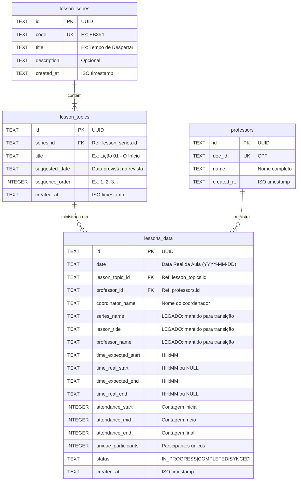

# Data Model: Migração do Schema para Estrutura Normalizada

**Feature**: 003-migrate-schema-structure
**Date**: 2026-01-31

## Entity Relationship Diagram



## Entities

### LessonSeries (NOVA)

Representa uma série/revista de lições (ex: "EB354 - Tempo de Despertar").

| Field | Type | Constraints | Description |
|-------|------|-------------|-------------|
| id | TEXT | PK, NOT NULL | UUID v4 |
| code | TEXT | UNIQUE, NOT NULL | Código identificador (ex: "EB354") |
| title | TEXT | NOT NULL | Título da série |
| description | TEXT | NULL | Descrição opcional |
| created_at | TEXT | DEFAULT CURRENT_TIMESTAMP | Data de criação |

**Validation Rules:**
- `code` deve ser único (normalizado: uppercase, sem espaços extras)
- `code` não pode ser vazio
- `title` não pode ser vazio

**State Transitions:** N/A (entidade estática)

---

### LessonTopic (NOVA)

Representa um tópico/lição individual dentro de uma série.

| Field | Type | Constraints | Description |
|-------|------|-------------|-------------|
| id | TEXT | PK, NOT NULL | UUID v4 |
| series_id | TEXT | FK, NOT NULL | Referência a lesson_series.id |
| title | TEXT | NOT NULL | Título do tópico |
| suggested_date | TEXT | NULL | Data sugerida (YYYY-MM-DD) |
| sequence_order | INTEGER | NOT NULL | Ordem na série (1, 2, 3...) |
| created_at | TEXT | DEFAULT CURRENT_TIMESTAMP | Data de criação |

**Validation Rules:**
- `series_id` deve referenciar série existente
- `title` não pode ser vazio
- `sequence_order` deve ser >= 1
- Combinação (`series_id`, `title` normalizado) deve ser única

**State Transitions:** N/A (entidade estática)

---

### Lesson (MODIFICADA)

Campos adicionados à tabela `lessons_data` existente.

| Field | Type | Constraints | Description |
|-------|------|-------------|-------------|
| lesson_topic_id | TEXT | FK, NOT NULL* | Referência a lesson_topics.id |

*NOT NULL para novos registros; registros migrados sempre terão valor.

**Campos Legados (mantidos):**
- `series_name`: Texto livre, mantido para compatibilidade
- `lesson_title`: Texto livre, mantido para compatibilidade
- `professor_name`: Texto livre, já marcado como deprecated

---

### Professor (SEM ALTERAÇÃO)

Entidade existente, incluída para referência de relacionamentos.

| Field | Type | Constraints | Description |
|-------|------|-------------|-------------|
| id | TEXT | PK, NOT NULL | UUID v4 |
| doc_id | TEXT | UNIQUE, NOT NULL | CPF |
| name | TEXT | NOT NULL | Nome completo |
| created_at | TEXT | DEFAULT CURRENT_TIMESTAMP | Data de criação |

---

## Relationships

| From | To | Cardinality | Description |
|------|----|-------------|-------------|
| lesson_series | lesson_topics | 1:N | Uma série contém múltiplos tópicos |
| lesson_topics | lessons_data | 1:N | Um tópico pode ter múltiplas aulas ministradas |
| professors | lessons_data | 1:N | Um professor pode ministrar múltiplas aulas |

---

## TypeScript Interfaces

### LessonSeries
```typescript
export interface LessonSeries {
  id: string;
  code: string;
  title: string;
  description: string | null;
  created_at: string;
}
```

### LessonTopic
```typescript
export interface LessonTopic {
  id: string;
  series_id: string;
  title: string;
  suggested_date: string | null;
  sequence_order: number;
  created_at: string;
}

// Tipo expandido para exibição (com JOIN)
export interface LessonTopicWithSeries extends LessonTopic {
  series_code: string;
  series_title: string;
}
```

### Lesson (atualizada)
```typescript
export interface Lesson {
  id: string;
  date: string;
  lesson_topic_id: string; // NOVO: obrigatório
  professor_id: string | null;
  coordinator_name: string;
  // Campos legados (mantidos para compatibilidade)
  series_name: string;
  lesson_title: string;
  professor_name: string;
  // ... demais campos existentes
  time_expected_start: string;
  time_real_start: string | null;
  time_expected_end: string;
  time_real_end: string | null;
  attendance_start: number;
  attendance_mid: number;
  attendance_end: number;
  unique_participants: number;
  status: LessonStatus;
  created_at: string;
}

// Tipo expandido para exibição (com JOINs)
export interface LessonWithDetails extends Lesson {
  topic_title: string;
  series_code: string;
  series_title: string;
  professor_name_resolved: string | null;
}
```

---

## Migration Data Flow

```
┌─────────────────────────────────────────────────────────────────┐
│                    DADOS EXISTENTES                             │
│  lessons_data.series_name = "EB354 - Tempo de Despertar"        │
│  lessons_data.lesson_title = "Lição 01 - O Início"              │
└─────────────────────────────────────────────────────────────────┘
                              │
                              ▼
┌─────────────────────────────────────────────────────────────────┐
│                    NORMALIZAÇÃO                                  │
│  normalize("EB354 - Tempo de Despertar") → "EB354"              │
│  normalize("Lição 01 - O Início") → "LIÇÃO 01 - O INÍCIO"       │
└─────────────────────────────────────────────────────────────────┘
                              │
                              ▼
┌─────────────────────────────────────────────────────────────────┐
│                    NOVAS ENTIDADES                               │
│  lesson_series { code: "EB354", title: "Tempo de Despertar" }   │
│  lesson_topics { title: "Lição 01 - O Início", series_id: X }   │
└─────────────────────────────────────────────────────────────────┘
                              │
                              ▼
┌─────────────────────────────────────────────────────────────────┐
│                    ATUALIZAÇÃO                                   │
│  lessons_data.lesson_topic_id = Y (referência ao tópico)        │
│  (campos legados preservados)                                    │
└─────────────────────────────────────────────────────────────────┘
```
